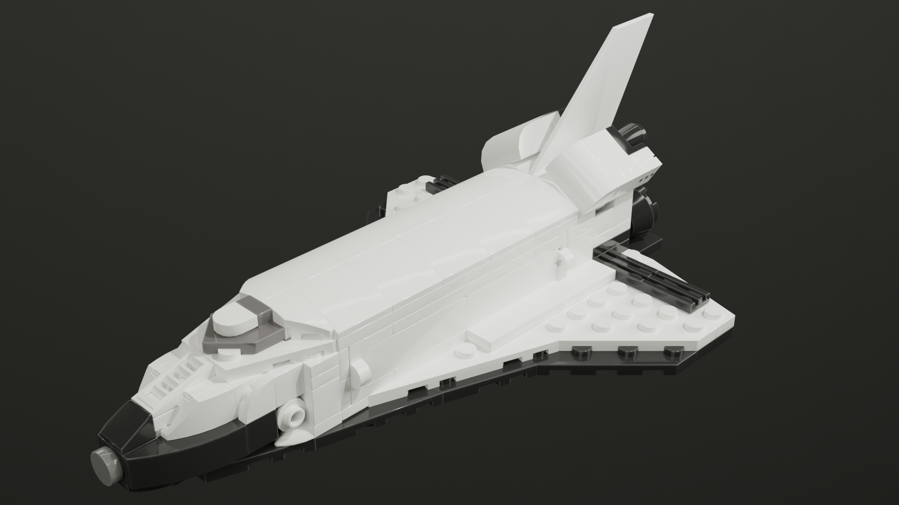

# Brix

Lego MOCs!

## ISS-scale Space Transportation System

An ISS-scale space shuttle with external tank and solid rocket boosters.

The 1:220 Lego Ideas [International Space Station (ISS)](https://www.lego.com/en-us/product/international-space-station-21321) comes with a half-scale shuttle.
The **ISS-scale Space Transportation System** (STS) MOC consists of a 1:220 space shuttle with external tank and boosters.
It features an openable bay, articulated arm and typical payload.

> [More details.](STS/README.md)